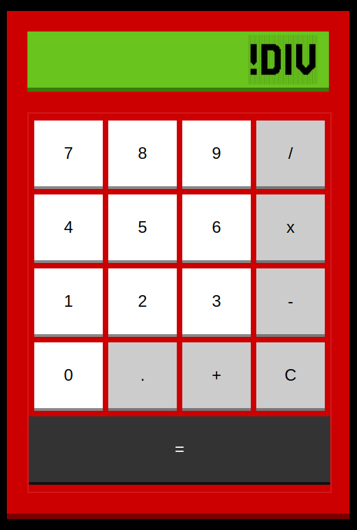

# odin-calculator

This is the last project on [The Odin Project](https://www.theodinproject.com/lessons/foundations-calculator)'s Foundations Course.
  
I found it a little more complex than the other TOP projects... I've never made a calculator before. I ended up in the need to refactor the code because, in the middle of it, it was becoming really messy :sweat_smile:... but refactoring really saved me and understanding what I had to do became much easier. Refactor your code!!! 
  
Flexed DOM Manipulation skills, logic, if-elses, switch cases & css flexbox.

I would like to thank all the volunteers of The Odin Project for making this course avaible for free :heart:
